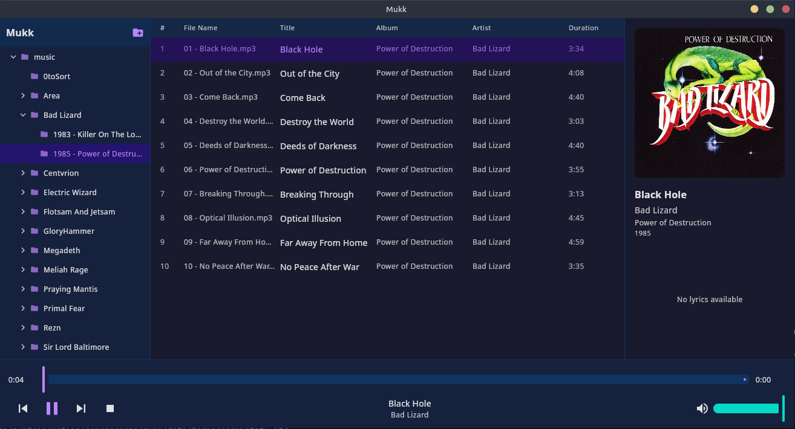

# Mukk

A desktop music player for Linux built with Kotlin Multiplatform and Compose Desktop.

Mukk uses file-system-based browsing — an AIMP-style folder tree with a track list, rather than a flat database-driven library. Browse your music collection by folders, view track metadata, and play audio with GStreamer.



## Build and Run

To build and run the desktop app from the terminal:

```shell
./gradlew :composeApp:run
```
